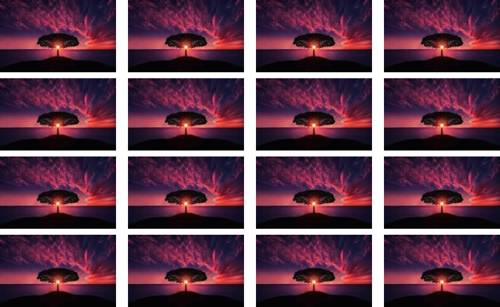
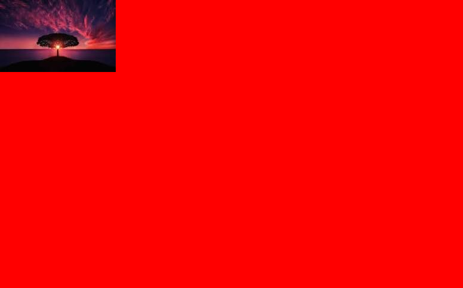

# image-joiner 🖼️

Fast and Easy node.js Image join Tool.

## Install

```sh
pnpm add sharp image-joiner
```
## Features

- Based on grid layout
- Easy and fast ⚡

## Usage

```ts
 import {GridImageJoiner} from "image-joiner"
 const joiner = new GridImageJoiner(4,4)

  joiner.loadImageFromLocal(file_name, {
    row: 0,
    col: 0,
  })

  joiner.loadImageFromLocal(file_name, {
    row: 1,
    col: 1
  })

  const image = joiner.draw()
  image.toFormat("png").toFile("output.png")
```

## Draw Options

```ts
export type DrawOptions = {
  resize?: {
    width: number;
    height: number;
  };
  row_gap?: number;
  col_gap?: number;
  background_color?: Color;
}
```

## Result

### Gap



### Resize


### Color



### Space


